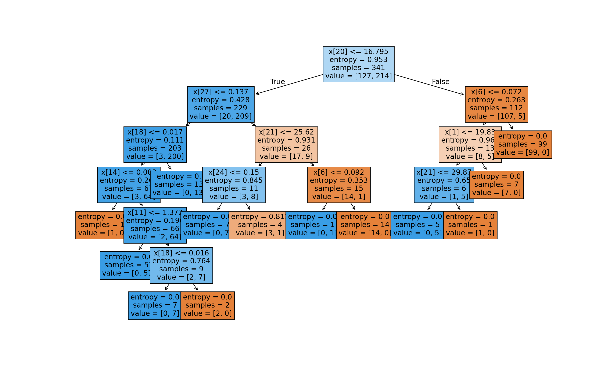
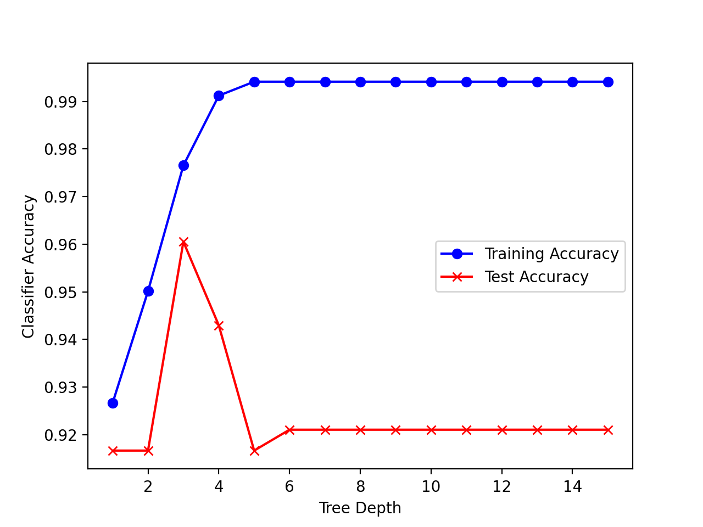
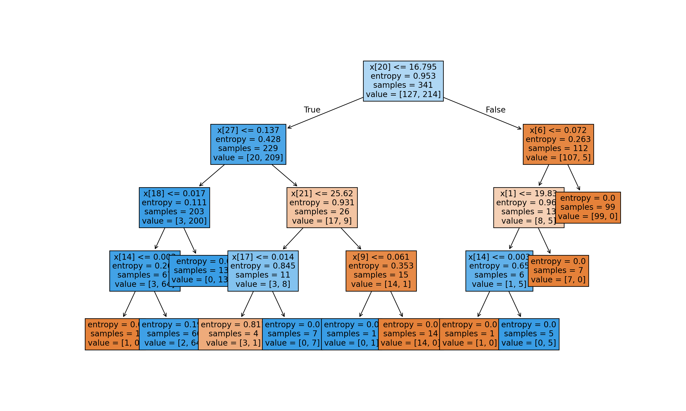

# 🧪 Decision Tree Classification on Breast Cancer Dataset

This Machine Learning project focused on implementing a **Decision Tree Classifier** using the **Breast Cancer Wisconsin dataset** from Scikit-learn. The analysis includes model training, evaluation, hyperparameter tuning, and tree visualization.

---

## 📌 Overview

The goal is to classify tumors as malignant or benign using a decision tree trained on clinical features from the dataset. The process includes:

- Data preprocessing and stratified train-test split.
- Decision Tree training with entropy-based splits.
- Accuracy evaluation and depth-based tuning.
- Hyperparameter optimization via GridSearchCV.
- Tree visualization and learning curve plotting.

---

## 🧠 Dataset

The dataset comes from `sklearn.datasets.load_breast_cancer()`. It contains:

- **569 instances**
- **30 numerical features**
- **Binary target**: 0 (malignant) or 1 (benign)

---

## 📊 Visualizations

### 🌳 Final Decision Tree (Full Depth)
This visualization shows the decision tree structure using the entropy criterion.



---

### 📈 Accuracy vs. Tree Depth
Training and test accuracy plotted across tree depths from 1 to 15.



---

### 🌳 Optimized Decision Tree via GridSearchCV
Best tree found using cross-validation and grid search for `max_depth` and `min_samples_split`.



---

## 🛠️ Technologies Used

- Python 3.x
- scikit-learn
- matplotlib
- Jupyter/IDLE

---

## 🚀 How to Run

1. Install dependencies:

   ```bash
   pip install scikit-learn matplotlib
