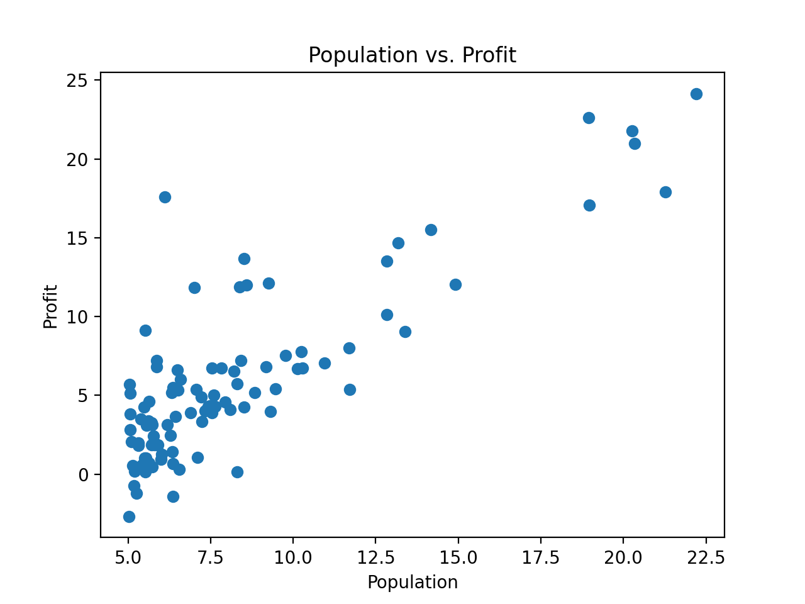
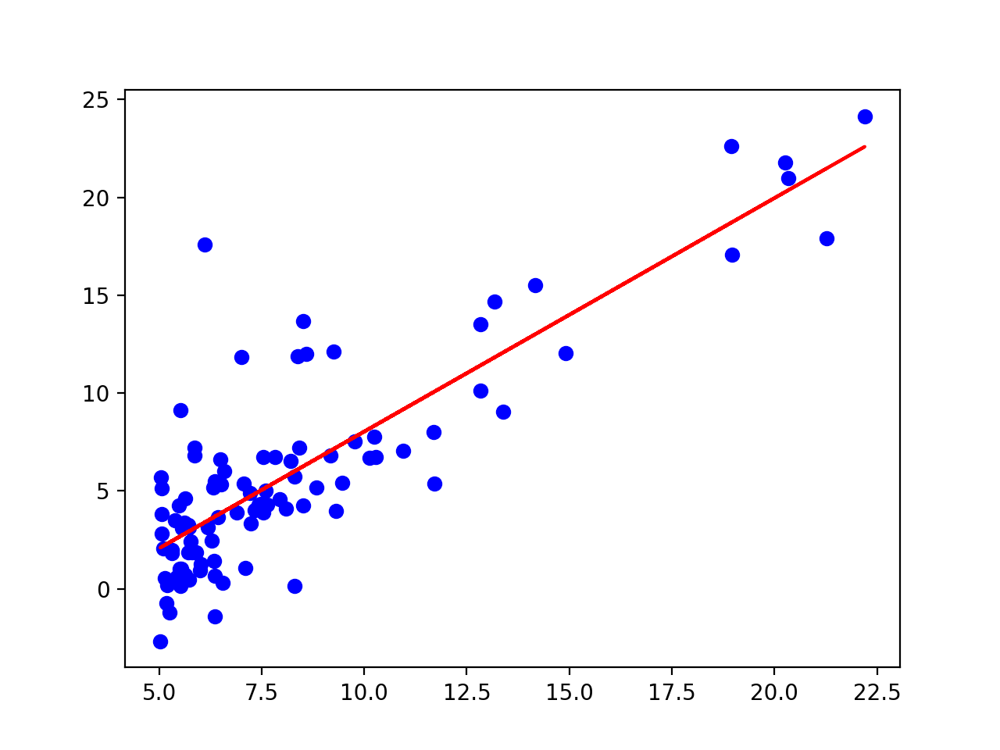
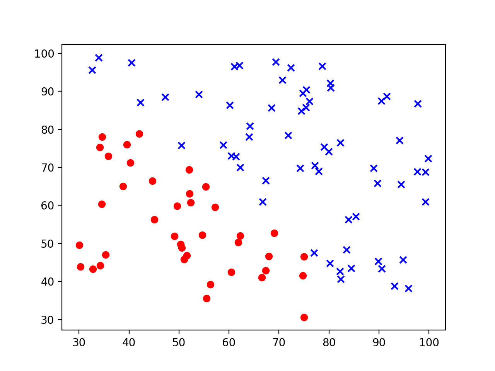
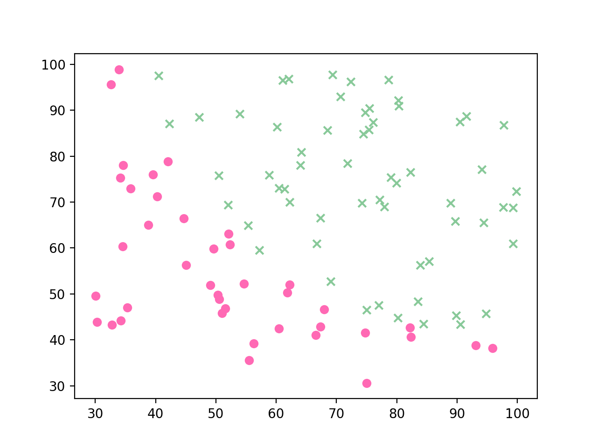

# 📊 Project 2: Linear & Logistic Regression

This project focuses on supervised learning techniques using regression models. It includes a **linear regression model** for predicting restaurant profits and a **logistic regression model** for predicting hiring decisions based on interview scores. The assignment also introduces multi-class classification using logistic regression extensions.

---

## 📚 Overview

### Part 1: Linear Regression
- Predicts restaurant **profit** from **city population**.
- Trains a model using least squares linear regression.
- Visualizes correlation and regression line.

### Part 2: Logistic Regression
- Predicts whether a candidate is hired based on two exam scores.
- Visualizes classification results with actual vs. predicted labels.

### Part 3: Multi-class Classification
- Explains **One-vs-Rest (OvR)** and **One-vs-One (OvO)** strategies using logistic regression.

---

## 🧪 Technologies
- Python 3.x
- pandas
- scikit-learn
- matplotlib

---

## 🖼️ Visualizations

### 📍 1. Population vs. Profit (Raw Data)
This scatter plot shows the correlation between city population and restaurant profit.



---

### 📍 2. Linear Regression Fit
The red line represents the best-fit regression line learned from the training data.



---

### 📍 3. Actual Hiring Decision (Ground Truth)
Red and blue markers represent the actual classes (hired vs. not hired) based on candidate scores.



---

### 📍 4. Predicted Hiring Decision (Logistic Regression Output)
Pink and green markers represent the predicted labels by the logistic regression classifier.



---

## 🚀 How to Run

1. Install dependencies:
   ```bash
   pip install pandas scikit-learn matplotlib
