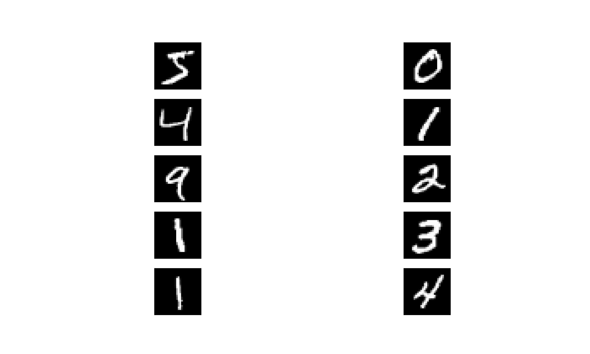
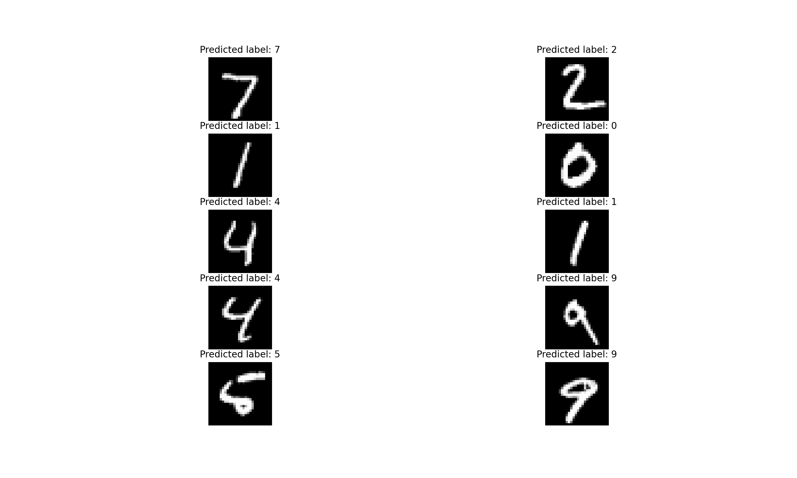

# 🤖 Project 3: Digit Recognition with Neural Networks (Keras + MNIST)

This project focuses on using **deep learning** to classify handwritten digits from the **MNIST** dataset using the **Keras** API built on TensorFlow. A simple feedforward neural network is constructed, trained, and evaluated to demonstrate fundamental neural network operations and predictions.

---

## 📚 Overview

- Dataset: **MNIST handwritten digits**
- Input: 28x28 grayscale images of digits (0–9)
- Task: Classify each image into one of 10 digit categories
- Framework: **Keras Sequential API**

---

## 🧠 Model Architecture

The neural network has the following structure:

| Layer         | Output Shape | Parameters |
|---------------|---------------|------------|
| Flatten       | (None, 784)   | 0          |
| Dense (ReLU)  | (None, 300)   | 235,500    |
| Dense (ReLU)  | (None, 100)   | 30,100     |
| Dense (Softmax)| (None, 10)   | 1,010      |

> **Total Trainable Parameters**: 266,610  
> The final layer uses **softmax** activation to output probability distributions over 10 classes.

---

## 🖼️ Visualizations

### 🖍️ 1. Sample Input Digits
Below are the first 10 digits from the MNIST training set:



---

### 🧪 2. Predicted Labels for Test Digits
This image shows the first 10 test samples with the predicted labels from the model:



---

## 🧪 Technologies Used

- Python 3.x
- TensorFlow / Keras
- NumPy
- Matplotlib

---

## 🚀 How to Run

1. Install dependencies:
   ```bash
   pip install tensorflow numpy matplotlib
