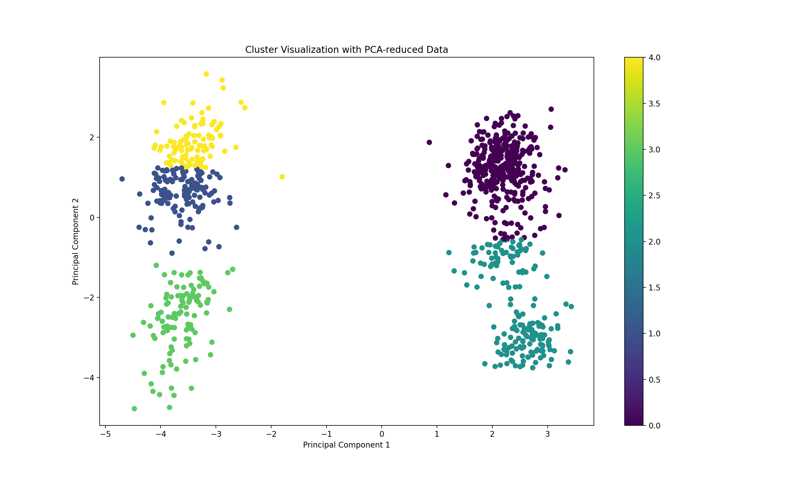

# 📈 Project 4: Clustering Human Activity Data (MHEALTH)

This project applies unsupervised learning techniques to identify clusters of physical activity using data from the **MHEALTH (Mobile Health)** dataset. The data was collected using wearable sensors placed on multiple body parts while volunteers performed various physical tasks.

---

## 📚 Overview

- **Goal**: Discover patterns in human physical activity using clustering.
- **Dataset Source**: UCI Machine Learning Repository — [MHEALTH Dataset](https://archive.ics.uci.edu/ml/datasets/MHEALTH)
- **Sensors Used**: Shimmer wearable devices placed on the **chest**, **wrist**, and **ankle**.
- **Features**: Accelerometer, gyroscope, magnetometer, and ECG signals.

---

## 🔍 Methodology

1. **Data Loading**: Subset of 1000 rows loaded from one participant's activity log (`mHealth_subject1.log`).
2. **Preprocessing**:
   - Removed missing values
   - Outlier filtering using **Z-score > 3**
3. **Standardization**: Scaled features using `StandardScaler` to normalize input data.
4. **Dimensionality Reduction**: Reduced to 2 principal components using **PCA** for visualization.
5. **Clustering**: Applied **KMeans** clustering with 5 clusters (`n_clusters=5`).
6. **Evaluation**: Measured **Silhouette Score** — value achieved: **0.66**
7. **Visualization**: Generated scatter plot to visualize cluster separation.

---

## 🖼️ Visualization

### 📍 PCA-Reduced Clustering Output

Each color represents one of the five clusters discovered by the KMeans algorithm, plotted using the first two principal components:

---

## 📊 Results Summary

- **Outliers Removed**: 100
- **Silhouette Score**: `0.66`
- **Cluster Quality**: Visual and metric-based assessment confirmed strong separation among clusters.
- **Interpretation**: Each cluster represents a distinct group of physical movements recorded by sensors — suitable for applications in fitness monitoring, rehabilitation, or health diagnostics.

---

## 🧪 Technologies Used

- Python 3.x
- pandas
- NumPy
- scikit-learn
- matplotlib

---

## 🚀 How to Run

> ⚠️ **Important**: The dataset is too large to host on GitHub. You must manually download the MHEALTH dataset and place it in the correct folder.

### 🔽 Download the dataset:
- **Link**: [https://archive.ics.uci.edu/ml/datasets/MHEALTH](https://archive.ics.uci.edu/ml/datasets/MHEALTH)

### 📁 Expected Folder Structure:
Create a folder named `MHEALTHDATASET/` and place the file `mHealth_subject1.log` inside it.

